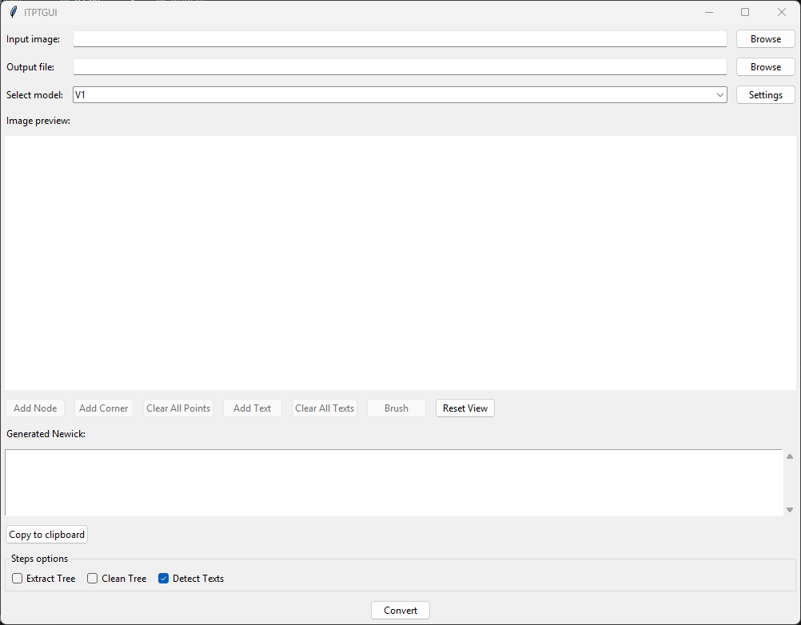

# ITPT

A Python library for converting phylogenetic tree images to Newick format.



## License

This project does not have a specific open-source license. All rights are reserved by the authors.

However, by being hosted on GitHub, this repository is subject to the [GitHub Terms of Service](https://docs.github.com/en/site-policy/github-terms/github-terms-of-service). Specifically, users are granted the right to view and fork this repository within the GitHub platform for personal or research purposes. Any other use, reproduction, or distribution of the code requires explicit permission of all authors.

## Project Structure

```
root/
    dev/
        _datasets_generation/
            ...
        _detectron/
            ...
        _evaluation/
            ...
        _heatmap/
            ...
        _notebooks/
            ...
        generators/
            __init__.py
            generator_from_notebook.py
    gui_vctk/
        __init__.py
        main.py
        ...
    gui_vtk/
        __init__.py
        main.py
        ...
    itpt/
        __init__.py
        _data/
            models/
                ...
        core/
            __init__.py
            branches.py
            model.py
            newick.py
            utils.py
        models/
            __init__.py
            registry.py
    media/
        demo.gif
    sandbox/
        main.py
        ...
    tools/
        __init__.py
        build.py
        clean.py
        generate_models.py
        run.py
    poetry.lock
    pyproject.toml
    README.md
    RELEASE.md
```

## Usage

### For Users

#### Installing ITPT from a `.whl` file

You can install ITPT directly from a pre-built wheel file (`.whl`). Follow these steps:

1. **Download the latest release**

Go to the [ITPT releases page](https://github.com/BDorian332/ITPT/releases) and download the `.whl` file from the latest release.

2. **Run the installation command**

```bash
pip install <path to the .whl just downloaded>
```

3. **Verify the installation**

```bash
pip show itpt
```

#### Library Usage

```python
from itpt.models import get_list, get_model

model_names = get_list()
print(model_names)

model = get_model("<model_name>")
model.load()

newick = model.convert("<input_path>")
print(newick.to_string())
```

#### GUI Usage

- [GUI vtk](gui_vtk/README.md)
- [GUI vctk](gui_ctk/README.md)

#### Available Models

**V1** - Cropping, Cleaning, Heatmap

**Methods**

1. **Loading the Model**

- Method: `load(cropping_model_weights_path_or_url=None, denoising_model_weights_path_or_url=None, nodesdetection_model_weights_path_or_url=None)`
- Description: Loads the model weights for cropping, denoising and nodes detection neural networks, and initializes the OCR text detection model.
- Parameters:
  - `cropping_model_weights_path_or_url` (str, optional): path or URL to the pre-trained cropping model weights. Defaults to `weights/cropping_model.pth` relative to the model directory in the library.
  - `denoising_model_weights_path_or_url` (str, optional): path or URL to the pre-trained denoising model weights. Defaults to `weights/denoising_model.pth` relative to the model directory in the library.
  - `nodesdetection_model_weights_path_or_url` (str, optional): path or URL to the pre-trained nodes detection model weights. Defaults to `weights/nodesdetection_model_weights.pth` relative to the model directory in the library.
- Notes: Sets the internal flag `_loaded = True` after successful loading.

2. **Conversion of Tree Images**

- Method: `convert(path_or_array)`
- Description: Converts an input image containing a phylogenetic tree into a Newick format string via a sequential pipeline.
- Parameters:
  - `path_or_array` (str or numpy array): path or array of the input image
- Steps:
  1. Calls `load_and_preprocess_image(path_or_array)` to read the image, resize it to 1500x1500px, and convert it to a tensor.
  2. Calls `extract_tree([img_rgb])` to extract the tree region using the `CroppingModel`.
  3. Calls `clean_tree(cropped_trees)` to denoise the result with the `DenoisingModel`.
  4. Calls `detect_nodes(cleaned_trees)` to identify nodes using `NodesDetectionModel`.
  5. Calls `detect_texts([img_rgb])` to run OCR and find texts on the original image.
  6. Calls `build_newick([nodes], [texts])` to generate the final object.
- Returns: `Newick` object representing the tree.

3. **Supporting Methods**

- `load_and_preprocess_image(path_or_array)`:
  - Loads and prepares the image and a tensor.
  - Returns `(img_rgb, img_tensor, (H, W))`.
- `extract_tree(imgs_rgb)`:
  - Uses `CroppingModel` to locate and crop trees from a list of images.
  - Returns `trees` (list of arrays of cropped images).
- `clean_tree(imgs_rgb)`:
  - Uses `DenoisingModel` to clean the extracted trees.
  - Returns `cleaned_trees` (list of arrays of cleaned images).
- `detect_nodes(imgs_rgb)`:
  - Uses `NodesDetectionModel` to analyzes cleaned images to detect junctions and tips.
  - Returns `nodes_by_image` (list of lists of `Point` representing images nodes).
- `detect_texts(imgs_rgb)`:
  - Uses OCR (`texts_detector_model`) to extract text from the images.
  - Returns `texts_by_image` (list of lists of texts of original images. Each text is represented by its string and its bounding box).
- `build_newick(nodes_by_image, texts_by_image)`:
  - Constructs a Newick object from detected nodes and texts for each image.
  - Returns `newick` (a `Newick` object).

### For Developers

### Requirements

- Python (>=3.13,<3.14)
- Poetry
- Tkinter (an optional Python module, only for the GUI)

#### Project Setup

```bash
poetry install
poetry install --with gui # installs needed dependencies for the GUI

{
    eval $(poetry env activate) # to activate the virtual environment
    jupyter notebook # to run Jupyter Notebook
}

OR

{
    poetry run jupyter notebook # to directly run Jupyter notebook with the Poetry virtual environment
}
```

#### Adding a New Model

1. Create a notebook in: notebooks/models/
2. Tag the cells you want exported with:

```json
{
    "export": true
}
```

#### Generate Models from Notebooks

```bash
poetry run itpt-generate-models
```

This produces directories and files under:

```
itpt/_data/models/<model_name>/
    model.py
    ? (if a pre-trained model can be generated manually with the notebook)
```

#### Clean temporary files

```bash
poetry run itpt-clean --models
```

```bash
poetry run itpt-clean --build
```

```bash
poetry run itpt-clean --run
```

```bash
poetry run itpt-clean --all
```

#### Build the Python Library

```bash
poetry run itpt-build --lib
```

#### Build the Standalone GUI

```bash
poetry run itpt-build --gui
```

#### Run GUI on-the-fly

```bash
poetry run itpt-run --gui
```

#### Run Sandbox on-the-fly

```bash
poetry run itpt-run --sandbox
```

## Contributors

- Barrère Dorian : [barreredorian332@gmail.com](mailto:barreredorian332@gmail.com)
- Accini Arthur : [acciniarth@cy-tech.fr](mailto:acciniarth@cy-tech.fr)
- Chamaillard Lucas : [lchamaillard.lucas@gmail.com](mailto:lchamaillard.lucas@gmail.com)
- Reyne Matteo : [reynematte@cy-tech.fr](mailto:reynematte@cy-tech.fr)
